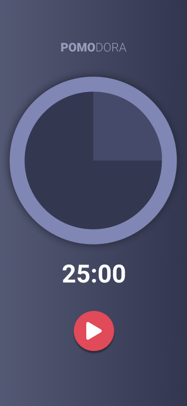

<h1 align="center">
  <p align="center">
    <strong>POMO</strong>DORA
  </p>
  
  <p align="center">
    App desenvolvido com base na live Frontend SP Meetup #34
  </p>
</h1>

<p align="center">
  🕒 Aumente a sua capacidade de gerenciar o tempo, de controlar as distrações e a sua produtividade.
</p>

<p align="center">
  <a href="https://reactjs.org/">
    
  </a>
  <a href="https://reactnative.dev/">
    
  </a>
  <a href="https://expo.io/">
    
  </a>
</p>

<div align="center">
  
  
  
</div>

## 📄 Indice

- [Sobre](#-sobre)
- [Tecnologias](#-tecnologias)
- [Como utilizar](#-como-utilizar)

## 📃 Sobre

A Técnica **Pomodoro** é um método de gerenciamento de tempo desenvolvido por Francesco Cirillo no final dos anos 1980. A técnica consiste na utilização de um cronômetro para dividir o trabalho em períodos de 25 minutos, separados por breves intervalos.

---

## 💻 Tecnologias

- ⚛️ **React** — A JavaScript library for building user interfaces
- ⚛️ **React Native** — A lib that provides a way to create native apps for Android and iOS

---

## 👨‍💻 Como utilizar

```bash
  # Clonar o repositório
  $ git clone https://github.com/denilsoncamara/ecoleta.git pomodoro

  # Entrar no diretório do projeto
  $ cd pomodoro

  # Instalar as dependências
  $ yarn install

  # Iniciar o projeto
  $ yarn start
```
---

🐱‍💻 Desenvolvido por _[Denilson Câmara](https://www.linkedin.com/in/denilsoncamara/)_
